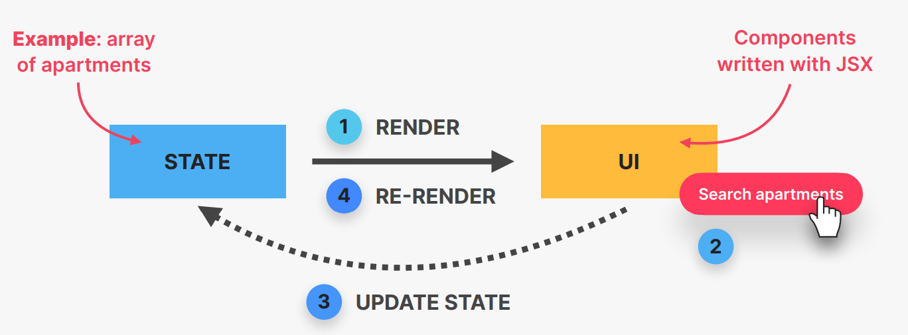
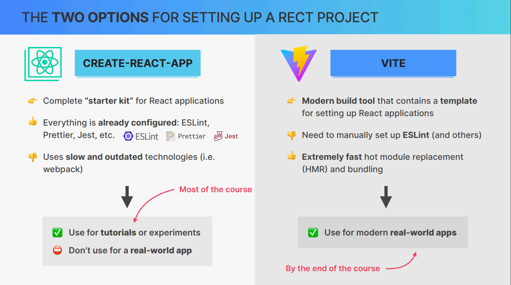

# React_JS
## What is React?
- React is a extremely popular declarative, component-based, state-driven JavaScript Library for building User Interfaces created by Facebook.
- React is good at rendering components on webpage based on their current state.
- React is best at keeping UI in sync with state, by re-rendering(reacting) when state changes.
    ### Based on Components:
    - Components are building blocks of UI in React
    - We build complex UIs by building and combining multiple components
    ### Decalrative:
    - We describe how the components look like and how they work using a declarative syntax called "JSX".
    - Decalarative: telling React what a component should look like, based on current data/state
    - React is abstraction away from DOM: we never touch DOM
    - JSX: a syntax that combines HTML, CSS, JavaScript as well as referencing other components.
    ### State-driven:
    - [](react_work.png)
    - React reacts to state changes by re-rendering the UI
    ### JavaScript Library:
    - React is just a library because it is only the "view" layer. We need to pickup multiple external libraries to build a complete application.
    ### Extremely Popular:
    - React is extremely used framework and is very popular.
    - Many large companies have adopted React.
    - Large and vibrant React developer community.
    - Gigantic third-party library ecosystem.
    ### Created by Facebook:
    - React was created in 2011 by Jordan Walke, an engineer working at Facebook at the time.
    - React was open-sourced in 2013, and has since then completely transformmed front-end web development.
## Installation:
- We have two options for setting up a React App.
    ### Two Options for setting up a React Project
    - [](options.png)
    
    ### What about React Frameworks?
    - The React team advises to use a "React Framework" for new projects like next.js
    - The framework like Next.js contains solutions for things like routing, data fetching and etc., which is nothing but a framework built on top of React Library which make building applications easier.

    ### Setting up project with create-reat-app
        ``` RUN npx create-react-app@<version> <name of the application> ```
    - @<version> is only specified when you want a specific version to be used, if don't give it, it automatically picks up the latest version.


## Components as Building Blocks:
- React applications are entirely made out of components
- Building blocks of UI in React
- Piece of UI that has its own data, logic, and appearance (how it works and looks)
- We build complex UIs by building multiple components and combining them.
- Components can be reused, nested inside each other, and pass data between them.

## What is JSX?
- Declarative syntax to describe what components look like and how they work
- Components must return a block of JSX
- Extension of JavaScript that allows us to embed JavaScript,CSS, and React components into HTML.
- Each JSX element is converted to a React.createElement function call.
- We could use React without JSX.
    ### JSX is Declarative
    - Imperative:
        - Manual DOM element selections and DOM traversing
        - Step up step DOM mutations until we reach the desired UI
    - Declarative:
        - Describe what UI should look like using JSX, based on current data.
        - React is an abstarction away from DOM: we never touch the DOM.
        - Instead we think of UI as a reflection of the current data.
## Props
- Props are used to pass data from parent components to child components
- Essential tool to configure and customize components
- With props, parent components control how child components look and work
- Anything can be passed as props: single values, arrays, objects, functions, even other components.
- Props are read-only!
    ### Why?
    - Mutating props would affect parent, creating side effects (not pure)
    - Components have to be pure functions in terms of props and state
    - This allows React to optimise apps, avoid bugs, make apps predictable.
