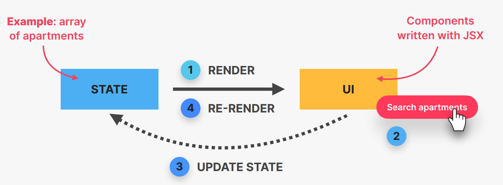

# React_JS
## What is React?
- React is a extremely popular declarative, component-based, state-driven JavaScript Library for building User Interfaces created by Facebook.
- React is good at rendering components on webpage based on their current state.
- React is best at keeping UI in sync with state, by re-rendering(reacting) when state changes.
    ### Based on Components:
    - Components are building blocks of UI in React
    - We build complex UIs by building and combining multiple components
    ### Decalrative:
    - We describe how the components look like and how they work using a declarative syntax called "JSX".
    - Decalarative: telling React what a component should look like, based on current data/state
    - React is abstraction away from DOM: we never touch DOM
    - JSX: a syntax that combines HTML, CSS, JavaScript as well as referencing other components.
    ### State-driven:
    - 
    - React reacts to state changes by re-rendering the UI
    ### JavaScript Library:
    - React is just a library because it is only the "view" layer. We need to pickup multiple external libraries to build a complete application.
    ### Extremely Popular:
    - React is extremely used framework and is very popular.
    - Many large companies have adopted React.
    - Large and vibrant React developer community.
    - Gigantic third-party library ecosystem.
    ### Created by Facebook:
    - React was created in 2011 by Jordan Walke, an engineer working at Facebook at the time.
    - React was open-sourced in 2013, and has since then completely transformmed front-end web development.

